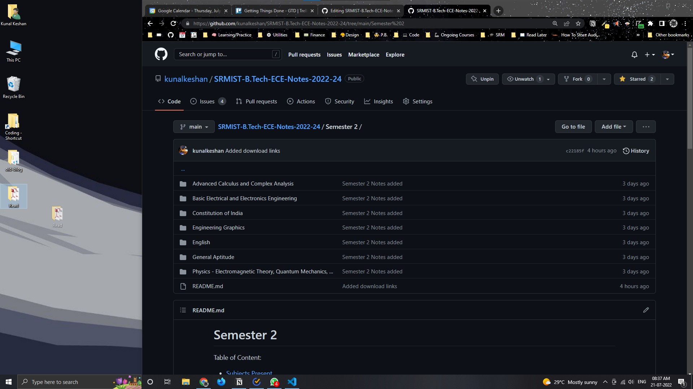

1. Fork this [Repository](https://github.com/kunalkeshan/SRMIST-B.Tech-ECE-Notes-2022-24/fork).
2. Upload Relavent material or changes that you think will be helpful to this Repo.

  | Select the folder you want to add your files to. | Drag and drop your folder to upload. (individual max file size: 25mb) |
  | ----- | ----- |
  |  |  |
  
3. Commit your changes.
4. Create a Pull Request to `main` branch.
5. Wait for it to be merged!

For any Queries on what type of material to add, contact [Kunal Keshan](mailto:kunalkeshan12@gmail.com).

Looking to contribute to the Website? Follow the [CONTRIBUTING.md](https://github.com/kunalkeshan/SRMIST-B.Tech-ECE-Notes-2022-24/blob/client/CONTRIBUTING.md) guidelines from the client branch.
