# ECE College Notes

Website to navigate around around for all courses with Repository, Drive and Download links readily available.

**Table of Contents**:

- [Contribute](#-contribute)
  - [Project Contributors](#-project-contributors)
- [Desktop UI](#-desktop-ui)
- [Mobile UI](#-mobile-ui)
- [License](#-license)
  - [Forking this Repo?](#-forking-this-repo)

## 📥 Contribute

Anybody is free to contribute to this repo. If you think that some material is relevant and can improve the quality of this repo, follow the contributing guidelines mentioned at [CONTRIBUTING.md](./CONTRIBUTING.md).

### 🦸 Project Contributors

## 🖥️ Desktop UI

| Landing Page | All Semester Navigation | Contribute CTA |
| --- | --- | --- |
| 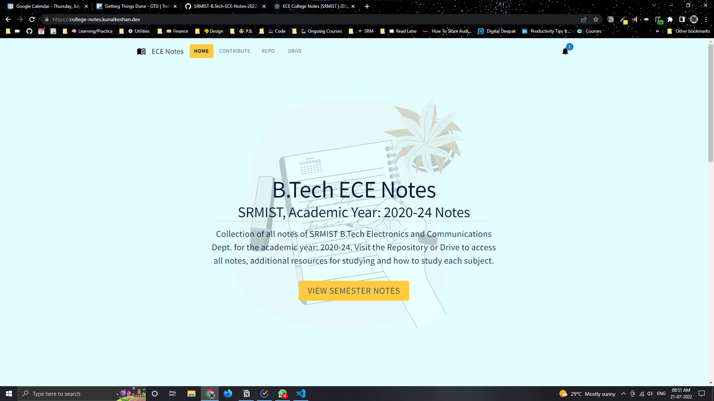 |  | 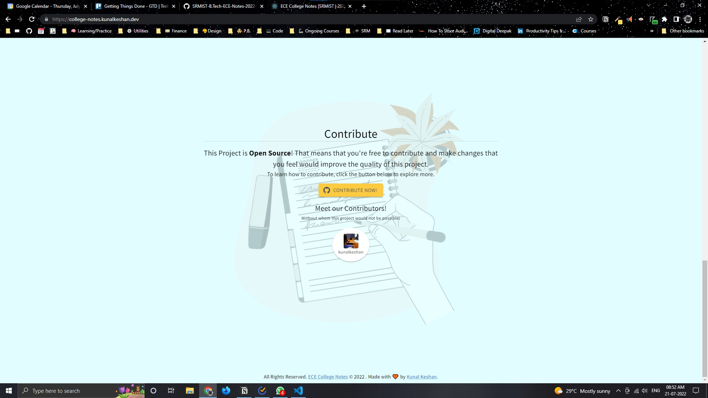 |

| Contribute Page | Notes Page | Not Found Page |
| --- | --- | --- |
|  | 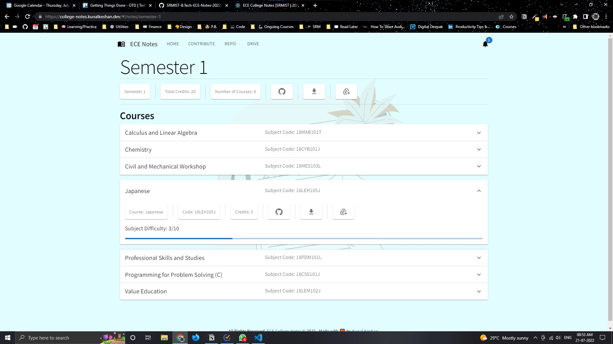 |  |

| Notification Dialog Box | Support Page | Contact Page |
| --- | --- | --- |
| 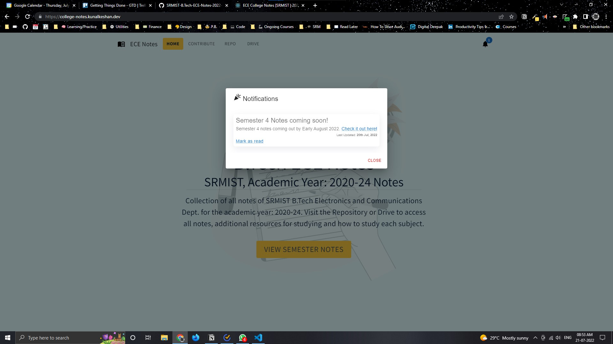 | 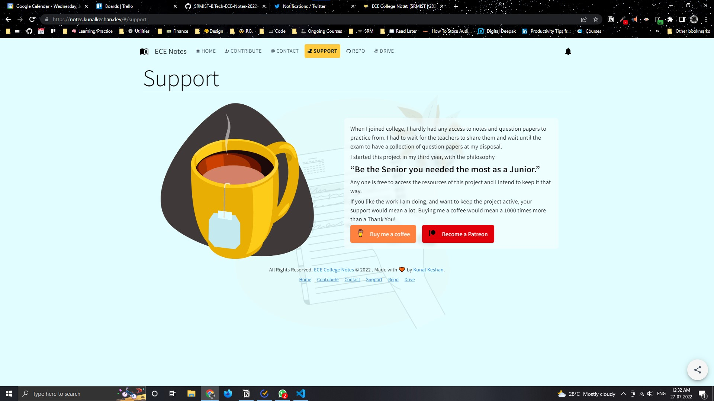 | 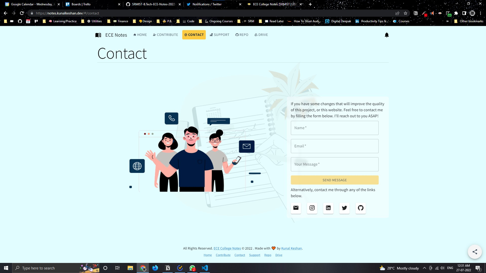 |

| Contributing Requests Page |
| --- |
| 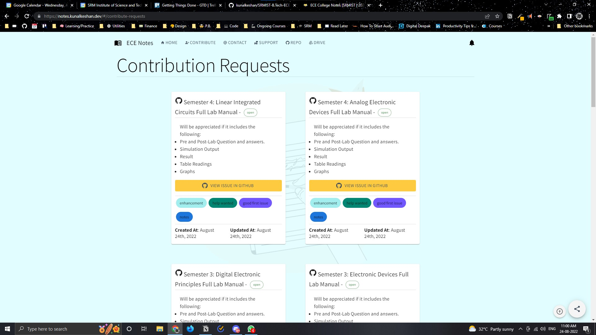 | 

## 📱 Mobile UI

|  |  | 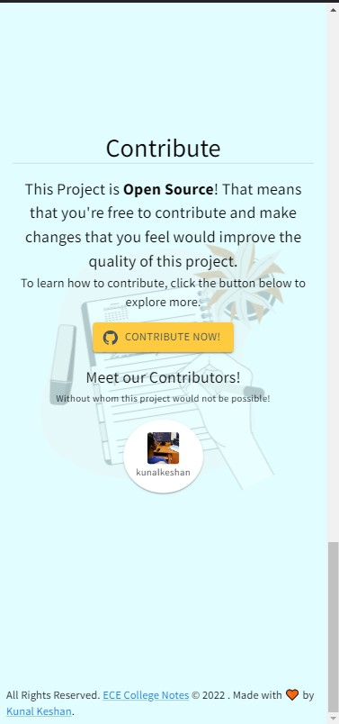 |
| --- | --- | --- |

|  |  |  |
| --- | --- | --- |

| 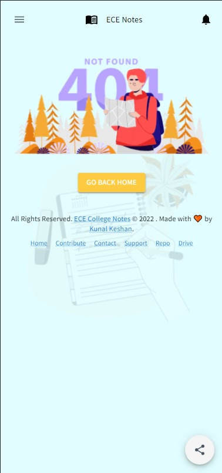 | 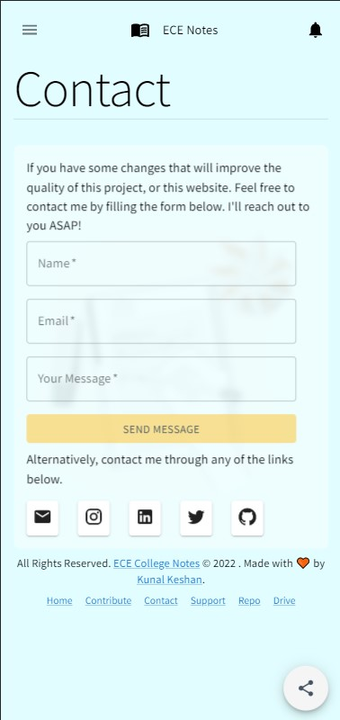 | 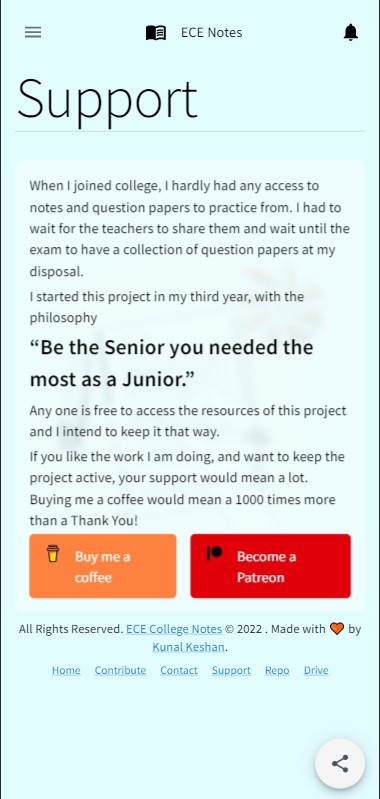 |
| --- | --- | --- |

| 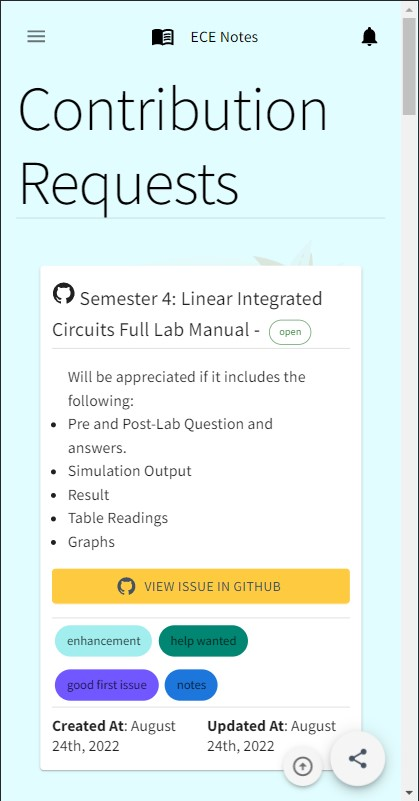 |
| --- |

## 📃 License

This website is licensed under the [MIT License](./LICENSE).

### 🗡️ Forking this Repo?

Many people have contacted us asking if they can use this code for their own websites. The answer to that question is usually "yes", with attribution. There are some cases, such as using this code for a business or something that is greater than a personal project, that we may be less comfortable saying yes to. If in doubt, please don't hesitate to ask us.

We value keeping this project open source, but as you all know, plagiarism is bad. We actively spend a non-negligible amount of effort developing, designing, and trying to perfect this iteration of our project, and we are proud of it! All we ask is to not claim this effort as your own.

So, feel free to fork this repo. If you do, please just give us proper credit by linking back to this repo, [https://github.com/kunalkeshan/SRMIST-B.Tech-ECE-Notes-2022-24](https://github.com/kunalkeshan/SRMIST-B.Tech-ECE-Notes-2022-24). Refer to this handy [quora](https://www.quora.com/Is-it-bad-to-copy-other-peoples-code) post if you're not sure what to do. Thanks!

--- 

If you found this project useful and interesting, leave a ⭐. It helps the project become more visible to others.

