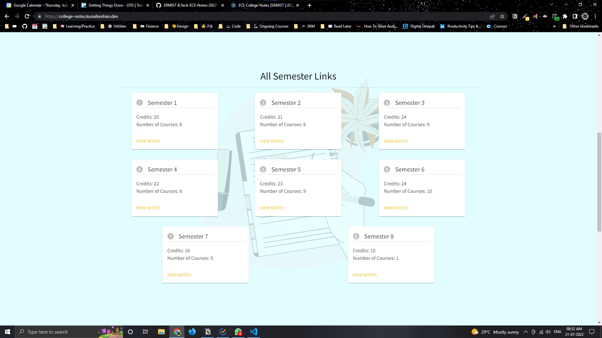
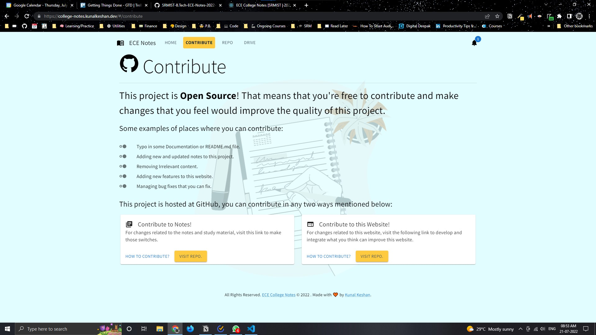
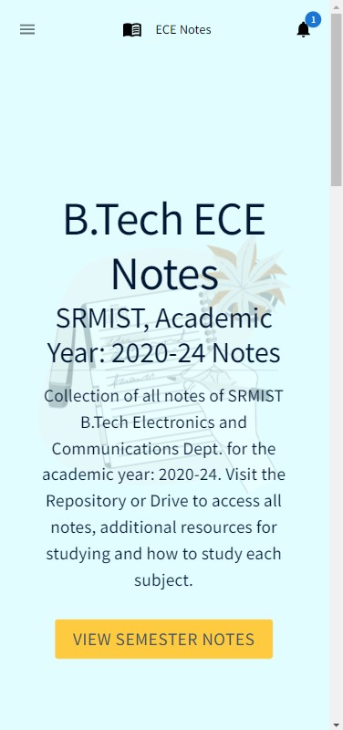
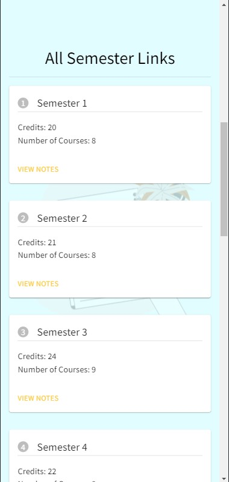
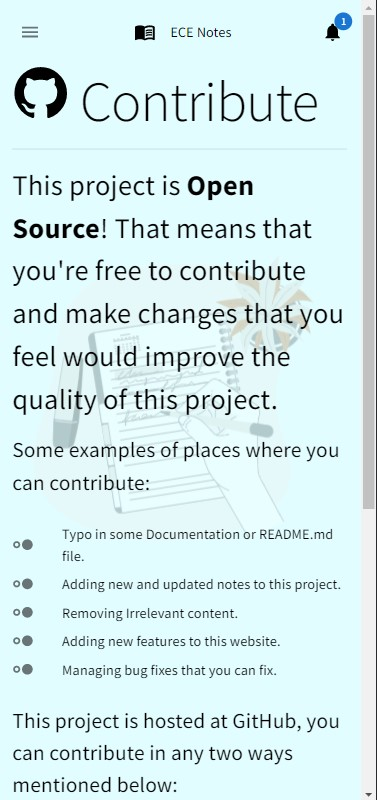
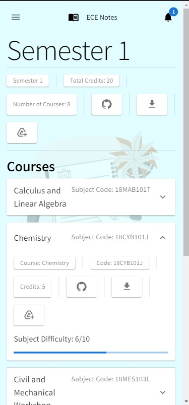

# ECE College Notes

Website to navigate around around for all courses with Repository, Drive and Download links readily available.

**Table of Contents**:

-   [Home Page](#home-page)
    -   [Landing](#landing)
    -   [All Semesters Nav](#all-semesters-nav)
    -   [Contribute CTA](#contribute-cta)
-   [Contribution Page](#contribute-page)
-   [Notes Page](#notes-page)
-   [Not Found Page](#not-found-page)
-   [Notification Dialog](#notification-dialog-box)
-   [Mobile UI](#mobile-ui)
-   [Contribute](#contribute)
-   [License](#license)

## Home Page

### Landing

### All Semesters Nav

### Contribute CTA

## Contribute Page

## Notes Page

## Not Found Page

Under Progress

## Notification Dialog Box

## Mobile UI

|  |  |  |
| --- | --- | --- |

|  |  |  |
| --- | --- | --- |

## Contribute

Anybody is free to contribute to this repo. If you think that some material is relevant and can improve the quality of this repo, follow the contributing guidelines mentioned at [CONTRIBUTING.md](./CONTRIBUTING.md).

### Project Contributors

## License

This website is licensed under the [MIT License](./LICENSE).
