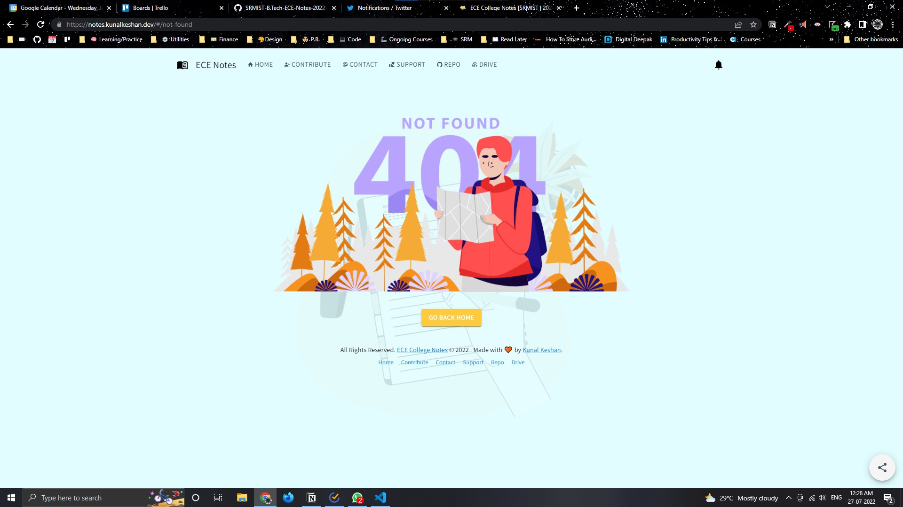

# ECE College Notes

Website to navigate around around for all courses with Repository, Drive and Download links readily available.

**Table of Contents**:

- [Contribute](#contribute)
- [Desktop UI](#desktop-ui)
- [Mobile UI](#mobile-ui)
- [License](#license)

## Contribute

Anybody is free to contribute to this repo. If you think that some material is relevant and can improve the quality of this repo, follow the contributing guidelines mentioned at [CONTRIBUTING.md](./CONTRIBUTING.md).

### Project Contributors

## Desktop UI

| Landing Page | All Semester Navigation | Contribute CTA |
| --- | --- | --- |
|  |  |  |

| Contribute Page | Notes Page | Not Found Page |
| --- | --- | --- |
|  |  |  |

| Notification Dialog Box | Support Page | Contact Page |
| ----------------------- | ------------ | ------------ |
|  |  |  |

## Mobile UI

|  |  |  |
| --- | --- | --- |

|  |  |  |
| --- | --- | --- |

|  |  |  |
| --- | --- | --- |

## License

This website is licensed under the [MIT License](./LICENSE).
